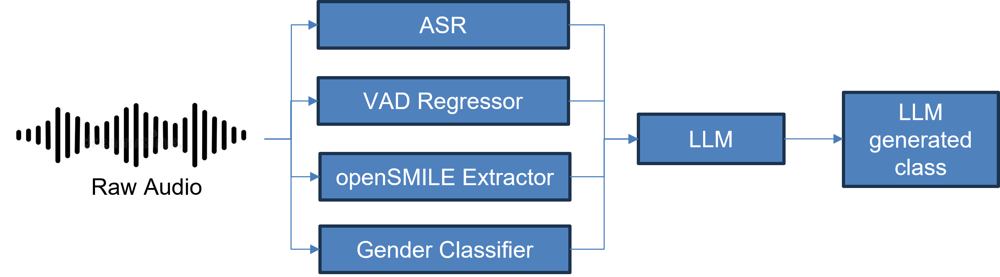
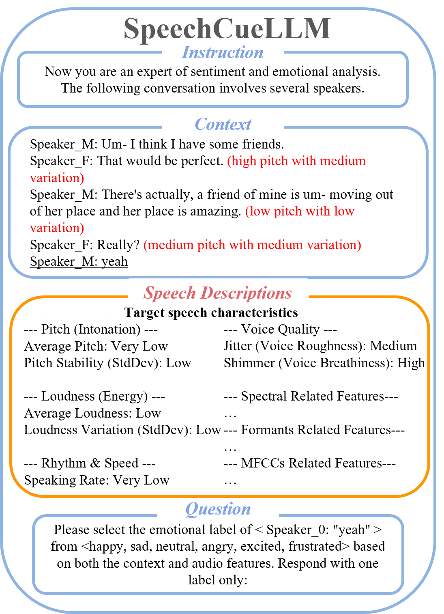

<!--  -->
# FYP_CCDS25-0121: Multimodal SER with Llama-3

**A robust Multimodal Speech Emotion Recognition (SER) framework that fine-tunes Llama-3 to process audio features alongside textual transcription.**

> **Key Result:** Achieved **72.0% Macro-F1** on IEMOCAP (SOTA-competitive) and **25.1% Macro-F1** in MSP-Podcast (Fine-Grained Emotions).

*Figure 1: End-to-end pipeline illustrating the audio frontend, feature extraction (OpenSMILE), and the LLM inference engine.*

---

## Key Innovations
This project builds upon the **SpeechCueLLM** architecture, introducing significant engineering optimizations for robustness and efficiency:

* **Structured Prompting Strategy:** Replaced unstructured narrative prompts with a rigorous **JSON-style structured format**. This improved token efficiency by **~30%** and reduced model hallucination.
* **Enhanced Feature Extraction:** Integrated the **OpenSMILE** toolkit to extract prosodic and spectral features, enriching the context provided to the LLM beyond standard ASR.
* **Emotional Dimensions Integration:** Integrated emotional dimensions (valence, arousal, dominance) into the feature set, enriching the context provided to the LLM.
* **Dynamic Feature Masking:** Implemented a training strategy that randomly masks specific modalities (audio/text) during fine-tuning. This forces the model to learn robust representations, preventing over-reliance on a single data stream.
* **Automated Audio Frontend:** Developed a dedicated `audio_frontend` module that automates the pipeline from raw `.wav` to **ASR** (Whisper), decoupled from the LLM environment.

---

## Architecture

### 1. Audio Frontend (`/audio_frontend`)
A standalone module designed to handle raw signal processing.
* **ASR Integration:** Uses OpenAI Whisper to generate high-fidelity transcripts.
* **VAD Regressor:** Predicts emotional dimensions (valence, arousal, dominance) of raw audio.
* **Gender Classifier:** Classify the gender of speakers.
* **Environment Isolation:** Runs in a dedicated environment to manage audio dependency conflicts (e.g., `ffmpeg`, `sox`) separately from the LLM stack.

### 2. The LLM Engine (Llama-3)
The core reasoning engine takes the processed inputs and generates emotion predictions.

  
  
<em>Figure 2: New Structured Prompt format.</em>

---

## Datasets & Compliance

This framework supports analysis on **IEMOCAP** and **MSP-Podcast**.

> **Licensing Note:**
> This repository contains **preprocessing code only**. It does **not** host the raw audio data or derived features, in strict compliance with the dataset licensing agreements.

### IEMOCAP
* **Status:** Preprocessing pipeline included.
* **Access:** Request directly from [USC SAIL Lab](https://sail.usc.edu/iemocap/iemocap_release.htm).

### MSP-Podcast
* **Status:** Preprocessing pipeline included.
* **Access:** Request directly from [UTD MSP Lab](https://www.lab-msp.com/MSP/MSP-Podcast.html).

---

## Acknowledgements & Credits
This project is an evolution of the SpeechCueLLM framework.

Original Architecture: SpeechCueLLM (https://github.com/zehuiwu/SpeechCueLLM)

Modifications: This implementation extends the original work by integrating OpenSMILE, introducing Dynamic Masking, and refactoring the prompting strategy for Llama-3 optimization.